# 📊 Customer Churn Classification

**Version:** v1.0.0


---

# Project Overview

This project focuses on predicting whether a customer is likely to churn using supervised machine learning techniques.

The primary objective is not only to build an accurate classification model, but also to develop a production-oriented machine learning project by following an end-to-end industry workflow.

The project is developed incrementally using a Sprint-based approach, where each Sprint focuses on a specific stage of the machine learning lifecycle, from business understanding to deployment.

---

# Business Problem

Customer churn is one of the most important challenges for subscription-based businesses such as telecommunications companies.

Acquiring new customers is generally more expensive than retaining existing ones. Therefore, identifying customers who are likely to leave before churn occurs enables businesses to take proactive actions and improve customer retention.

An accurate churn prediction system can help organizations:

* Identify customers with a high risk of churn
* Prioritize retention efforts efficiently
* Reduce customer acquisition and marketing costs
* Support data-driven business decisions
* Improve customer satisfaction and long-term loyalty

---

# Project Objectives

The goals of this project are to:

* Understand the business problem
* Explore and understand the dataset
* Perform Exploratory Data Analysis (EDA)
* Build a reproducible preprocessing pipeline
* Train baseline classification models
* Compare multiple machine learning algorithms
* Optimize model performance through hyperparameter tuning
* Analyze classification thresholds
* Interpret model predictions using Explainable AI techniques (SHAP)
* Perform comprehensive error analysis
* Deploy the final production model
* Document every engineering decision throughout the project
* Compare multiple baseline classifiers using a unified evaluation framework

---

# Project Workflow

```
Project Setup & Business Understanding
                ↓
Dataset Exploration (EDA)
                ↓
Data Cleaning
                ↓
Feature Engineering
                ↓
Baseline Models
(Logistic, DT, KNN, NB, RF, SVM)
                ↓
Baseline Model Comparison
                ↓
Hyperparameter Tuning
                ↓
Threshold Optimization
                ↓
Explainability (Feature Importance + SHAP)
                ↓
Error Analysis
                ↓
Deployment Preparation
                ↓
FastAPI Deployment
                ↓
Final Documentation & GitHub Release
```

---

# Key Features

* Sprint-based development
* Professional project structure
* Reproducible machine learning pipeline
* Multiple model comparison
* Hyperparameter optimization
* Threshold optimization
* Feature importance analysis
* Permutation importance
* Explainable AI (SHAP)
* Error analysis
* FastAPI deployment
* Comprehensive documentation
* Portfolio-ready implementation
* Professional evaluation framework


---

# Tools & Libraries

* Python
* NumPy
* Pandas
* Matplotlib
* Scikit-learn
* SHAP
* Joblib
* FastAPI
* Uvicorn

---

# Dataset Information

| Property | Value                 |
| -------- | --------------------- |
| Dataset  | Telco Customer Churn  |
| Task     | Binary Classification |
| Target   | Churn                 |
| Samples  | 7043                  |
| Features | 20                    |

---

# Models

The following models will be implemented and evaluated throughout the project:

• Logistic Regression
• Decision Tree
• K-Nearest Neighbors (KNN)
• Gaussian Naive Bayes
• Random Forest
• Support Vector Machine (SVM)
• Gradient Boosting Models (Planned)
• Hyperparameter Optimized Models

Additional models may be included depending on project requirements and experimental results.

Logistic Regression was selected as the baseline classifier because it is simple, interpretable, computationally efficient, and provides a strong reference point for comparing more complex classification algorithms.

---

# Evaluation Metrics

Model performance will be evaluated using multiple classification metrics, including:

* Accuracy
* Precision
* Recall
* F1-Score
* ROC-AUC
* PR-AUC
* Confusion Matrix
* Calibration Analysis (Planned)

The final production model will be selected based on both predictive performance and business value rather than relying on a single evaluation metric.

---

# Repository Structure

```
CustomerChurnClassification/

│
├── data/
│   ├── raw/
│   └── processed/
│
├── notebooks/
├── models/
│   ├── logistic_regression_pipeline.joblib
│   └── config.json
├── reports/
├── figures/
│
├── README.md
├── PROJECT_JOURNAL.md
├── CHANGELOG.md
├── TEAM_GUIDE.md
├── requirements.txt
│
└── .gitignore
```

---

## Project Progress

- ✅ Sprint 01 — Dataset Understanding & Exploratory Data Analysis
- ✅ Sprint 02 — Data Cleaning & Preprocessing
- ✅ Sprint 03 — Logistic Regression Baseline
- ✅ Sprint 04 — Decision Tree Baseline
- ✅ Sprint 05 — K-Nearest Neighbors & Gaussian Naive Bayes
- ✅ Sprint 06 — Random Forest Baseline
- ✅ Sprint 07 — Support Vector Machine
- ✅ Sprint 08 — Baseline Model Comparison
- ✅ Sprint 09 — Hyperparameter Tuning
- ✅ Sprint 10 — Model Explainability
- ✅ Sprint 11 — Error Analysis
- ✅ Sprint 12 — Threshold Optimization & Deployment Preparation
- ✅ Sprint 13 — FastAPI Deployment

---

# Project Status

✅ Version 1.0.0 Released

**Current Phase:**

Production Ready 🚀

---

## Models Evaluated

- Logistic Regression (Baseline)
- Decision Tree (Baseline)
- KNN (Baseline)
- GaussianNB (Baseline)
- Random Forest (Baseline)
- Support Vector Machine (Baseline)
---

## Model Performance

| Model                       |  Accuracy | Precision |    Recall |        F1 |
| --------------------------- | --------: | --------: | --------: | --------: |
| Logistic Regression (Tuned) | **0.806** | **0.656** | **0.567** | **0.608** |
| Random Forest (Tuned)       |     0.788 |     0.630 |     0.488 |     0.550 |
| SVC (Tuned)                 |     0.777 |     0.588 |     0.535 |     0.560 |

After hyperparameter optimization, Logistic Regression remained the best-performing model in terms of overall trade-off between Accuracy, Precision, Recall, and F1-score.


---

## Final Selected Model

After evaluating multiple baseline models and performing hyperparameter optimization, Logistic Regression was selected as the final production model.

Reasons:

- Best overall balance between Precision and Recall.
- Highest F1-score among optimized models.
- Highly interpretable.
- Computationally efficient.
- Well suited for threshold optimization.
- Production-ready deployment pipeline.

The final deployment threshold was optimized to 0.40 based on business requirements.

---

## Candidate Models for Hyperparameter Tuning

Based on the baseline comparison, the following models were selected for further optimization:

- Logistic Regression
- Random Forest
- Support Vector Machine

These models demonstrated the strongest balance between predictive performance, business value, and optimization potential.

---

## Explainability

### Logistic Regression Coefficients

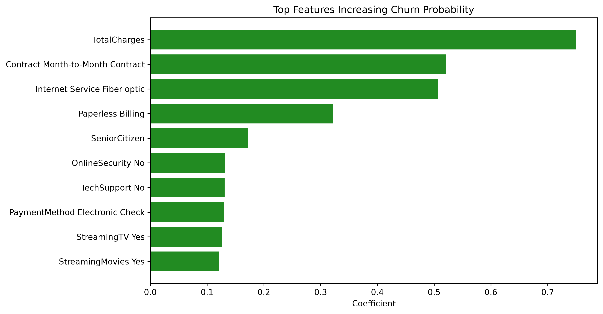

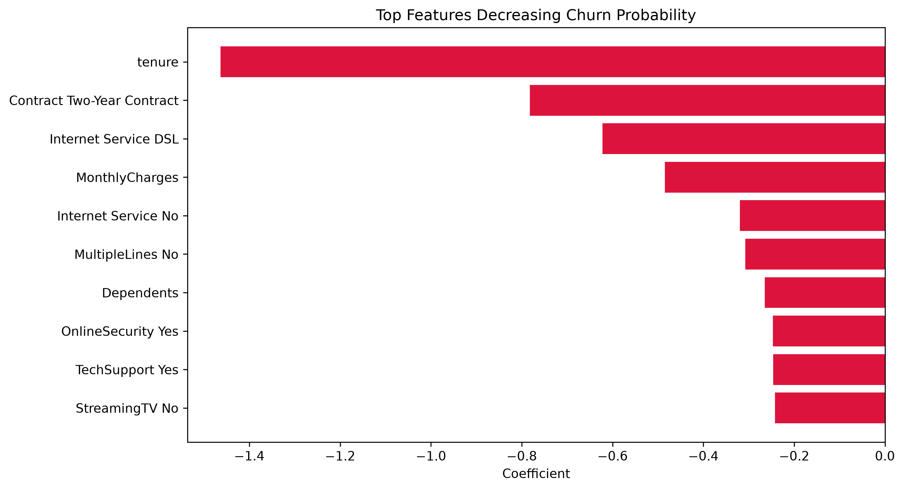

---

### Permutation Importance

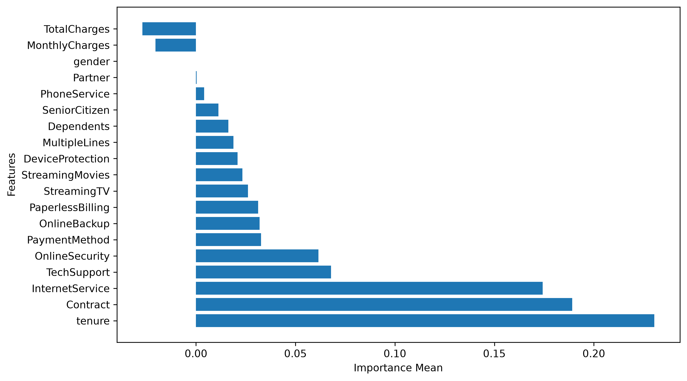

---

### SHAP Summary


---

### SHAP Waterfall


---

The interactive SHAP Force Plot is available in:

`figures/Sprint10/shap_force_plot.html`

## Error Analysis

### Error Distribution

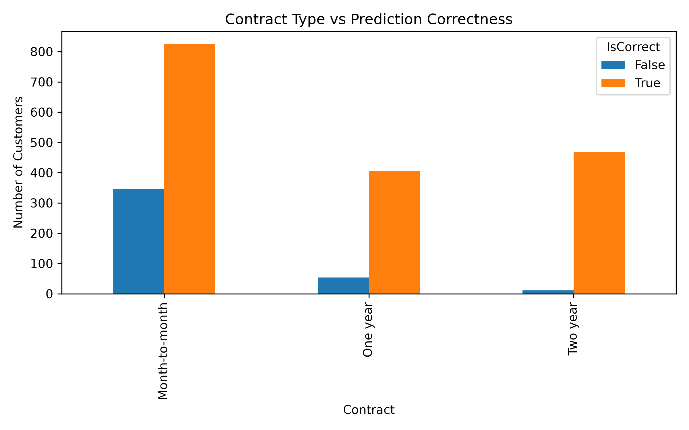

### Tenure Comparison

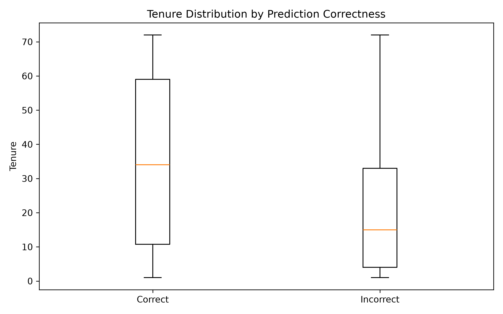

### Monthly Charges Comparison

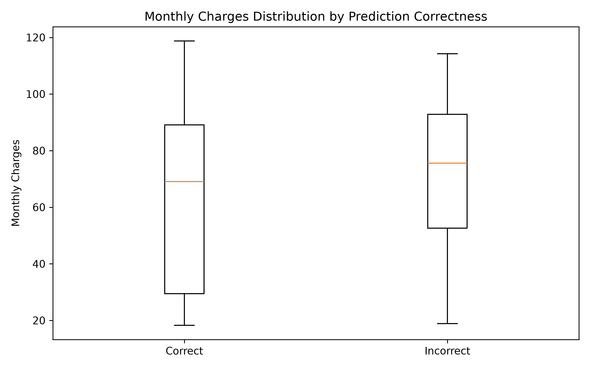

---

## Threshold Optimization

The default classification threshold (0.50) was evaluated against multiple operating points.

The final threshold was selected based on business objectives rather than accuracy alone.

Final Threshold:

0.40

This threshold provided the best trade-off between Precision and Recall while minimizing False Negatives for customer churn prediction.

### Threshold Analysis

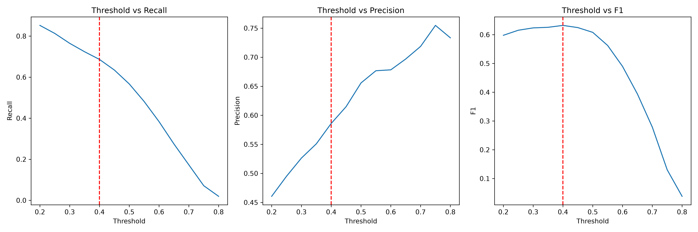

### ROC Curve

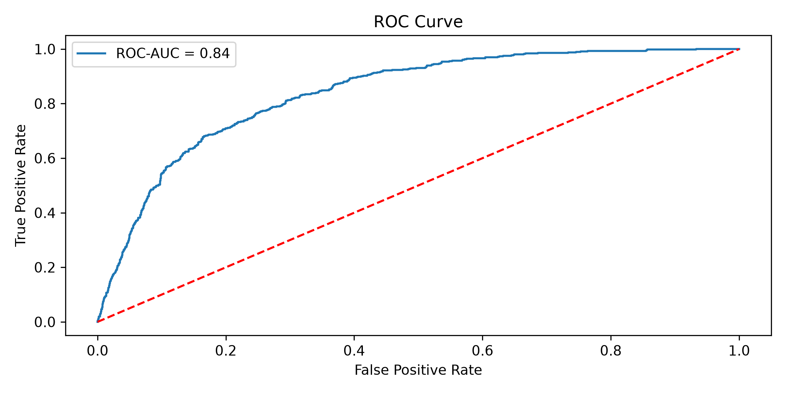

### Precision–Recall Curve

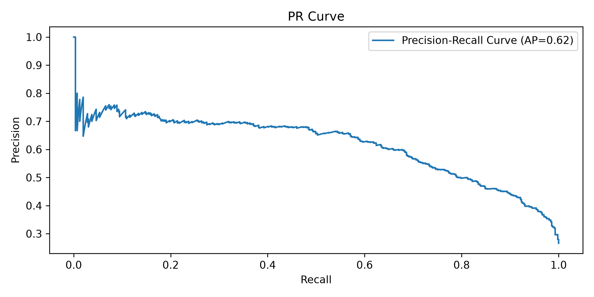

---

# Development Methodology

This repository follows a Sprint-based development workflow inspired by real-world machine learning engineering practices.

Each Sprint includes:

* Planning
* Implementation
* Technical review
* Documentation
* Git version control
* Sprint retrospective
* Baseline benchmarking
* Deployment Validation

---

# Future Improvements

Planned enhancements include:

* Docker

* Cloud Deployment

* CI/CD

* MLflow

* Monitoring

* Drift Detection
  
* Retraining

* A/B Testing

---

# License

This project is developed for educational and portfolio purposes while following professional machine learning engineering practices.

---

# API Demo

## Swagger UI

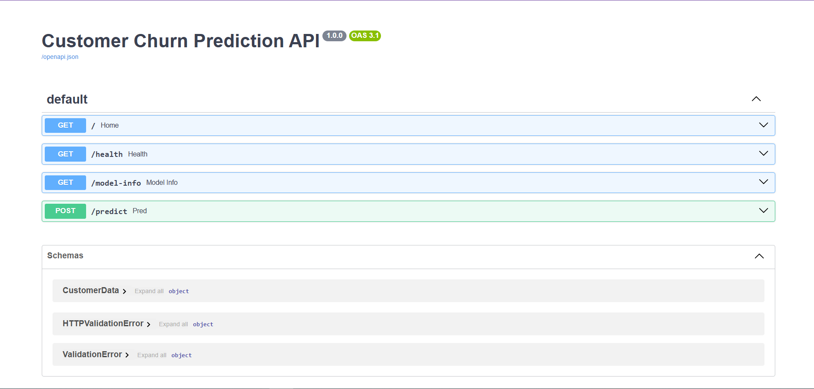

---

## Prediction Example

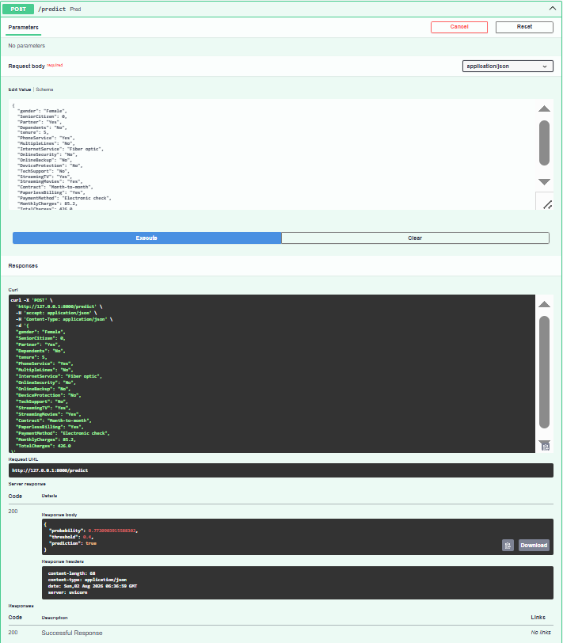

---

## Model Information

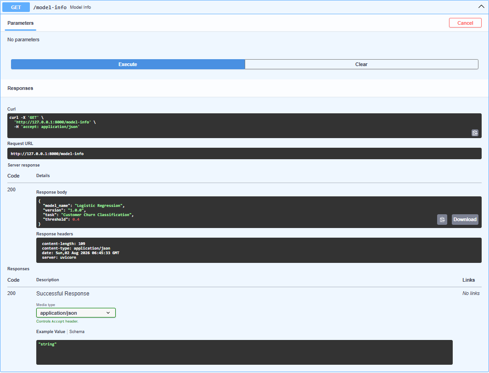

---

## Health Check

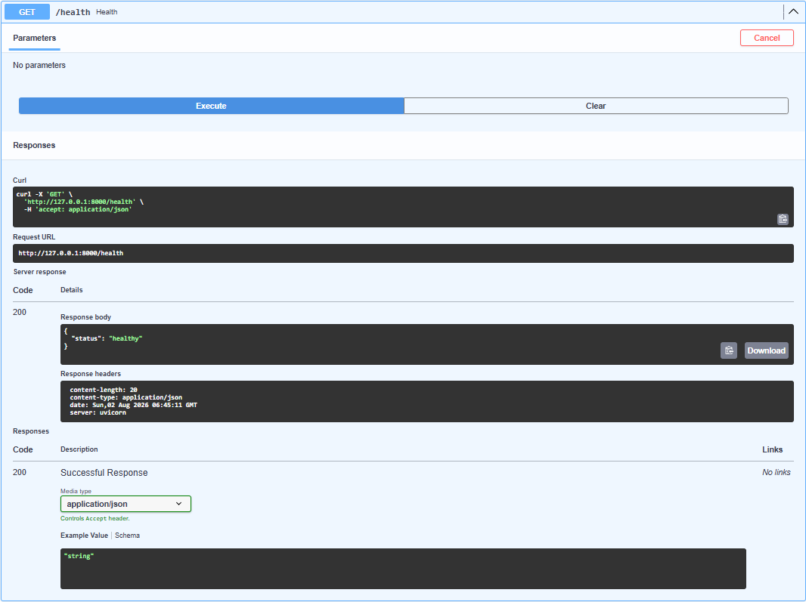

---

# Final Release

Version 1.0.0 marks the completion of the first production-ready release of this project.

This release includes:

- End-to-End Machine Learning Pipeline
- Model Comparison
- Hyperparameter Optimization
- Explainability (SHAP)
- Error Analysis
- Threshold Optimization
- FastAPI Deployment
- Complete Engineering Documentation